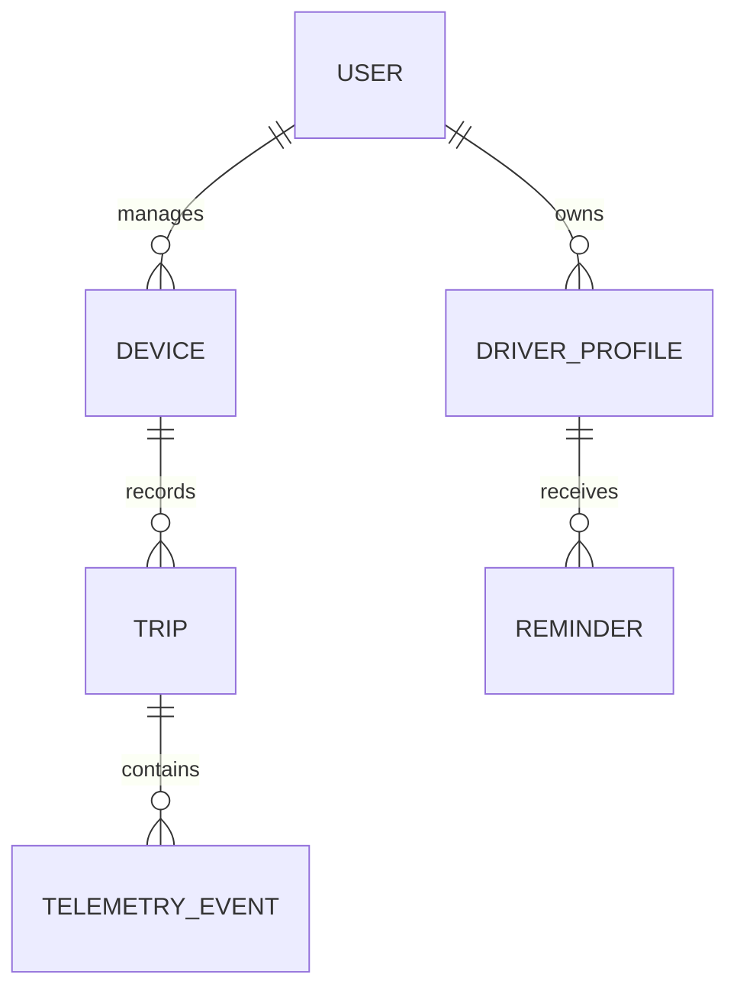

# Guardian - ER Diagram

> **Status:** Draft foundation | **Owner:** TBD | **Review cadence:** monthly and at each design gate

## Purpose

Define the decisions, evidence, and acceptance criteria for **ER Diagram** so the Guardian team can move from discovery to a safe, testable product decision.

## Scope

This document covers clear ownership, least-privilege access, retention controls, and evolution without data loss. It applies to the India-first MVP for mid-range and older passenger vehicles; it excludes direct vehicle actuation, safety-critical driving control, and unsupported vehicle modifications.

## Goals

1. Establish a clear decision boundary and a measurable definition of done.
2. Record cross-functional constraints before implementation or supplier commitment.
3. Make trade-offs traceable across device, mobile, cloud, AI, security, and operations.

## Architecture / decision model

| Layer | Responsibility | Decision criteria |
|---|---|---|
| Experience | Driver and owner outcome for ER Diagram | Safe, understandable, low-friction |
| Device and vehicle edge | Capture, process, and protect vehicle-adjacent signals | Plug-and-play, resilient, no vehicle control |
| Mobile and cloud | Identity, synchronization, configuration, and support | Secure, observable, cost-conscious |
| Governance | Privacy, safety, testing, and release approval | Evidence-backed, auditable, reversible |

## Reference diagram

## Workflows

1. **Discover:** collect requirements, vehicle evidence, user research, and applicable compliance inputs.
2. **Specify:** document interfaces, failure behavior, metrics, and safety/privacy constraints.
3. **Validate:** review with product, engineering, security, QA, and operations; test on representative vehicles.
4. **Release:** approve against defined gates, monitor outcomes, and record learnings in the decision log.

## Requirements and acceptance criteria

| ID | Requirement | Evidence of completion |
|---|---|---|
| 09-ER-DIAGRAM-01 | Outcome and owner are explicit | Reviewed specification and accountable DRI |
| 09-ER-DIAGRAM-02 | Failure behavior protects the driver and vehicle | Test record, safe-state definition, and support playbook |
| 09-ER-DIAGRAM-03 | Data handling follows consent and retention policy | Privacy/security sign-off and audit trail |

## Risks and mitigations

- **Primary risk:** Unauthorized access, data leakage, or an unbounded cost/reliability failure can damage customer trust.
- **Mitigation:** validate early with representative vehicles/users, instrument outcomes, and use staged rollout with rollback.
- **Escalation trigger:** any safety incident, material privacy issue, vehicle compatibility regression, or missed release gate.

## Assumptions

- Guardian reads supported vehicle data through a non-invasive OBD-II connection; it does not command vehicle controls in the MVP.
- The initial product targets a retail device price of INR 8,000-INR 10,000 in India, requiring disciplined component and cloud cost choices.
- Phone connectivity may be intermittent; core driver-facing behavior must degrade safely offline.

## Dependencies

- Related foundation: [Master Roadmap](../00_Master_Roadmap/master-roadmap.md) | [Overall Architecture](../03_System_Architecture/overall-architecture.md) | [Threat Model](../13_Security/threat-model.md) | [Integration Testing](../14_Testing/integration-testing.md) | [MVP Scope](../01_Product/mvp-scope.md)
- Inputs: customer research, vehicle compatibility matrix, security review, and release-test evidence.
- Decisions requiring approval: product owner, systems architect, security lead, and QA/release owner as applicable.

## TODO - research and decisions

- [ ] Identify the exact MVP vehicle makes/models and regional OBD-II/CAN compatibility constraints.
- [ ] Confirm applicable India regulations, certifications, privacy obligations, and wireless approvals with qualified counsel/labs.
- [ ] Set quantitative targets for latency, availability, power draw, unit cost, and support burden.
- [ ] Assign a named DRI, approver, and target design-review date.

## Future improvements

- Expand evidence and acceptance thresholds after the first field cohort.
- Introduce country-specific variants only after compatibility, localization, certification, and support readiness are demonstrated.
- Evaluate future vehicle-control capabilities only under a separate functional-safety, legal, and insurance program.

## References

- [Master Roadmap](../00_Master_Roadmap/master-roadmap.md)
- [Overall Architecture](../03_System_Architecture/overall-architecture.md)
- [Threat Model](../13_Security/threat-model.md)
- [Integration Testing](../14_Testing/integration-testing.md)

## Version history

| Version | Date | Author | Change |
|---|---|---|---|
| 0.1 | 2026-08-03 | Guardian documentation bootstrap | Initial engineering template tailored to ER Diagram |
